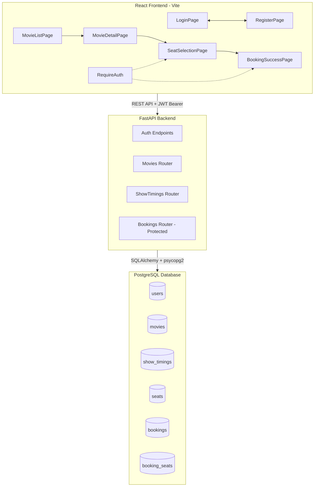

# Movie Ticket Booking App — Implementation Plan & Documentation

## 1. Tech Stack

| Layer        | Technology                             |
|--------------|----------------------------------------|
| Frontend     | React 18 (Vite), React Router v6       |
| Styling      | Plain CSS (single `App.css`)           |
| Backend      | Python FastAPI                         |
| ORM          | SQLAlchemy 2.0                         |
| Database     | PostgreSQL                             |
| DB Driver    | psycopg2-binary                        |
| Auth         | JWT (PyJWT) + bcrypt (passlib)         |
| HTTP Client  | Axios (frontend → backend)             |

---

## 2. Architecture Overview



---

## 3. Data Model

### `users`

| Column         | Type          | Constraints       |
|----------------|---------------|--------------------|
| id             | SERIAL        | PK                 |
| username       | VARCHAR(100)  | UNIQUE, NOT NULL   |
| email          | VARCHAR(255)  | UNIQUE, NOT NULL   |
| hashed_password | VARCHAR(255) | NOT NULL           |

### `movies`

| Column       | Type         | Constraints           |
|-------------|-------------|-----------------------|
| id          | SERIAL       | PK                    |
| title       | VARCHAR(255) | NOT NULL              |
| description | TEXT         |                       |
| poster_url  | VARCHAR(500) |                       |
| genre       | VARCHAR(100) |                       |
| duration    | INTEGER      | (minutes)             |
| language    | VARCHAR(100) |                       |

### `show_timings`

| Column    | Type         | Constraints              |
|-----------|-------------|---------------------------|
| id        | SERIAL       | PK                        |
| movie_id  | INTEGER      | FK → movies.id, NOT NULL  |
| hall_name | VARCHAR(100) | NOT NULL                  |
| show_time | TIMESTAMP    | NOT NULL                  |
| price     | NUMERIC(8,2) | NOT NULL                  |

### `seats`

| Column         | Type         | Constraints                   |
|----------------|-------------|--------------------------------|
| id             | SERIAL       | PK                             |
| show_timing_id | INTEGER      | FK → show_timings.id, NOT NULL |
| row_label      | VARCHAR(5)   | NOT NULL (A, B, C...)          |
| seat_number    | INTEGER      | NOT NULL (1, 2, 3...)          |
| is_booked      | BOOLEAN      | DEFAULT FALSE                  |

### `bookings`

| Column            | Type          | Constraints              |
|-------------------|---------------|---------------------------|
| id                | SERIAL        | PK                        |
| user_id           | INTEGER       | FK → users.id, NOT NULL   |
| user_name         | VARCHAR(255)  | NOT NULL                  |
| user_email        | VARCHAR(255)  | NOT NULL                  |
| booking_reference | VARCHAR(20)   | UNIQUE, NOT NULL          |
| total_amount      | NUMERIC(8,2)  | NOT NULL                  |
| booking_time      | TIMESTAMP     | NOT NULL (default now())  |

### `booking_seats`

| Column    | Type    | Constraints                  |
|-----------|---------|------------------------------|
| id        | SERIAL  | PK                           |
| booking_id| INTEGER | FK → bookings.id, NOT NULL   |
| seat_id   | INTEGER | FK → seats.id, NOT NULL      |
| UNIQUE    | —       | (booking_id, seat_id)        |

---

## 4. API Endpoints

### Auth (public)

| Method | Path                | Auth | Description                        |
|--------|---------------------|------|------------------------------------|
| POST   | `/api/auth/register`| No   | Create account, returns JWT         |
| POST   | `/api/auth/login`   | No   | Login, returns JWT                  |
| GET    | `/api/auth/me`      | JWT  | Get current user info               |

### Movies & Shows (public)

| Method | Path                           | Auth | Description                                |
|--------|--------------------------------|------|--------------------------------------------|
| GET    | `/api/movies`                  | No   | List all movies (?genre= & ?language=)      |
| GET    | `/api/movies/{id}`             | No   | Single movie + its show timings             |
| GET    | `/api/show-timings/{id}/seats` | No   | Seat layout for a specific show             |

### Bookings (protected — JWT required)

| Method | Path                           | Auth | Description                      |
|--------|--------------------------------|------|----------------------------------|
| POST   | `/api/bookings`               | JWT  | Create a booking                 |
| GET    | `/api/bookings/{reference}`    | No   | Retrieve booking by reference    |

**`POST /api/bookings` request:**

```json
{
  "user_name": "Mohan",
  "user_email": "mohan@example.com",
  "show_timing_id": 3,
  "seat_ids": [12, 13, 14]
}
```

**Response:**

```json
{
  "booking_reference": "MOV-ABC123",
  "total_amount": 750.00,
  "seats": ["A-4", "A-5", "A-6"],
  "movie_title": "Inception",
  "show_time": "2026-07-20T18:30:00",
  "hall_name": "Hall 1",
  "user_name": "Mohan",
  "user_email": "mohan@example.com"
}
```

---

## 5. Authentication Flow

- **JWT** encoded with HS256, signed using `SECRET_KEY` from [`config.py`](backend/config.py)
- Token expiry: **24 hours**
- Token stored in `localStorage` on the frontend
- [`api.js`](frontend/src/api.js) Axios interceptor auto-attaches `Authorization: Bearer <token>` to every request
- [`RequireAuth`](frontend/src/App.jsx) component wrapper redirects unauthenticated users to `/login`
- Passwords hashed with **bcrypt** via `passlib`

---

## 6. Frontend Route & Component Tree

```
App
├── Header
│   ├── Logo (link to /)
│   ├── [Logged Out] Login link | Register link
│   └── [Logged In]  👤 username | Logout button
├── Routes
│   ├── / → MovieListPage          (public)
│   │       ├── SearchBar
│   │       ├── FilterTabs (genre, language)
│   │       └── MovieCard[] (poster, title, genre, duration)
│   ├── /movie/:id → MovieDetailPage  (public)
│   │       ├── MovieInfo (poster, description, genre, lang, duration)
│   │       └── ShowTimingCard[] (hall, time, price → Book button)
│   ├── /login → LoginPage         (public)
│   │       └── Form + demo hint (demo / demo123)
│   ├── /register → RegisterPage   (public)
│   │       └── Form (username, email, password)
│   ├── /book/:showTimingId → SeatSelectionPage  (protected)
│   │       ├── ScreenIndicator
│   │       ├── SeatMap (grid: rows A–F × cols 1–10)
│   │       │   └── Seat[] (🟢 available / 🔵 selected / 🔴 booked)
│   │       ├── SeatLegend
│   │       └── BookingForm (user details + confirm button)
│   └── /booking/:reference → BookingSuccessPage  (protected)
│           └── BookingDetails (reference, movie, time, seats, amount)
└── Footer
```

---

## 7. Seat Map Design

- **Rows**: A through F (6 rows)
- **Columns**: 1 through 10 (10 seats per row)
- **Total**: 60 seats per hall per show
- **Colors**:
  - 🟢 Green = Available
  - 🔵 Blue = Selected
  - 🔴 Red = Booked (dimmed, not clickable)

---

## 8. Project Structure (Flat, Simplified)

```
Agentic AI/
├── .gitignore
├── plans/
│   └── movie-ticket-booking-plan.md   ← This file
│
├── backend/
│   ├── main.py                        # FastAPI app + ALL routes (movies, auth, bookings)
│   ├── database.py                    # SQLAlchemy engine (PostgreSQL), session, Base
│   ├── config.py                      # DATABASE_URL, SECRET_KEY, CORS origins
│   ├── models.py                      # 6 ORM models: User, Movie, ShowTiming, Seat, Booking, BookingSeat
│   ├── schemas.py                     # All Pydantic schemas (auth, movie, booking)
│   ├── seed.py                        # Seed: drop → create → populate (5 original movies + demo user)
│   ├── add_movie.py                   # Utility: add extra movies (e.g., Jananayagan)
│   └── requirements.txt               # fastapi, uvicorn, sqlalchemy, psycopg2, passlib, PyJWT, bcrypt
│
└── frontend/
    ├── index.html
    ├── package.json
    ├── package-lock.json
    ├── vite.config.js
    └── src/
        ├── main.jsx                   # React entry point → BrowserRouter → App
        ├── App.jsx                    # Routes + RequireAuth + layout
        ├── App.css                    # ALL styles (~700 lines, dark theme)
        ├── api.js                     # Axios instance + token interceptor + all API functions
        ├── Header.jsx                 # Nav bar (logo, login/register or username/logout)
        ├── MovieCard.jsx              # Movie poster card component
        ├── ShowTimingCard.jsx         # Show timing row with Book button
        ├── Seat.jsx                   # Single clickable seat square
        ├── SeatMap.jsx                # 6×10 grid with screen and legend
        ├── MovieListPage.jsx          # Home page: movie grid + search + filters
        ├── MovieDetailPage.jsx        # Movie info + show timing list
        ├── SeatSelectionPage.jsx      # Seat picker + user form + confirm booking
        ├── BookingSuccessPage.jsx     # Ticket confirmation with all details
        ├── LoginPage.jsx              # Login form + demo credentials hint
        └── RegisterPage.jsx           # Registration form
```

---

## 9. Setup Instructions

### Prerequisites
- Python 3.11+
- Node.js 18+
- PostgreSQL running on `localhost:5432`

### Step 1: Database
```sql
CREATE DATABASE movie_booking;
```
Update credentials in [`backend/config.py`](backend/config.py) if needed.

### Step 2: Backend
```bash
cd backend
pip install -r requirements.txt
python seed.py        # Creates all tables + populates 5 movies, demo user
python add_movie.py   # (Optional) Adds "Jananayagan" extra movie
uvicorn main:app --reload --host 0.0.0.0 --port 8000
```
Runs on `http://localhost:8000`

### Step 3: Frontend
```bash
cd frontend
npm install
npm run dev
```
Runs on `http://localhost:5173`

### Demo Login
| Username | Password |
|----------|----------|
| `demo`   | `demo123` |

---

## 10. Key Design Decisions

1. **JWT Authentication** — users register/login to get a JWT. Booking endpoints require `Authorization: Bearer <token>`. Browsing movies and shows is public.

2. **Pessimistic locking for seat booking** — `POST /api/bookings` uses `SELECT ... FOR UPDATE` to prevent double-booking. Returns `409 Conflict` with conflicting seat labels if any seat is already taken.

3. **Flat file structure** — no nested `pages/`, `components/`, or `routers/` directories. All backend routes live in a single [`main.py`](backend/main.py). All frontend styles live in a single [`App.css`](frontend/src/App.css).

4. **Seat pre-generation** — 60 seats per show timing are created by [`seed.py`](backend/seed.py), so no dynamic generation at runtime.

5. **CORS enabled** — FastAPI allows the Vite dev server origin (`http://localhost:5173`).

6. **PyJWT** (not `python-jose`) — `python-jose` 3.3.0 had JWT decode failures on Windows; switched to `PyJWT 2.9.0` for reliable token handling.

---

## 11. Seed Data

### Movies (6 total)

| ID | Title            | Genre    | Language | Duration |
|----|------------------|----------|----------|----------|
| 1  | Inception        | Sci-Fi   | English  | 148 min  |
| 2  | Interstellar     | Sci-Fi   | English  | 169 min  |
| 3  | The Dark Knight  | Action   | English  | 152 min  |
| 4  | Parasite         | Thriller | Korean   | 132 min  |
| 5  | Dune             | Sci-Fi   | English  | 155 min  |
| 6  | Jananayagan      | Drama    | Tamil    | 165 min  |

### Show Timings
- **2 per movie** (Hall 1 at ₹250, Hall 2 at ₹350)
- **60 seats per show timing** (A1–F10)
- **Total: 12 show timings, 720 seats**

### Demo User
- **username:** `demo`
- **password:** `demo123`
