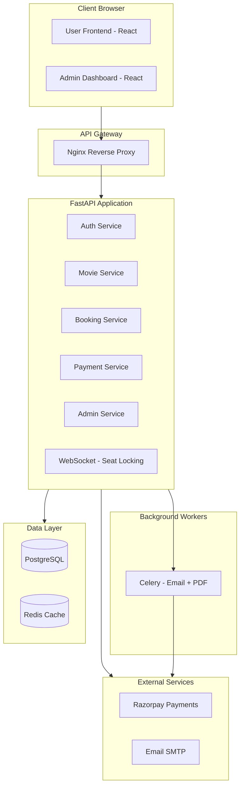

# Movie Ticket Booking System — Production-Grade Upgrade Plan

## Overview

This document outlines the phased upgrade of the existing movie ticket booking app into a **production-ready, portfolio-grade full-stack application**. The plan covers 10 phases, ~50+ new features, and a complete architectural restructure.

---

## Target Tech Stack (Upgraded)

| Layer              | Current                    | Upgraded To                          |
|--------------------|----------------------------|--------------------------------------|
| Frontend           | React 18 + Vite            | React 18 + Vite + Zustand (state)    |
| Styling            | Plain CSS                  | Tailwind CSS or CSS Modules           |
| Backend            | FastAPI (flat main.py)     | FastAPI (modular routers/services)    |
| ORM                | SQLAlchemy 2.0             | SQLAlchemy 2.0 + Alembic (migrations)|
| Database           | PostgreSQL                 | PostgreSQL + Redis (caching/locking)  |
| Auth               | JWT (PyJWT)                | JWT access + refresh tokens, RBAC    |
| Real-time          | —                          | WebSocket (seat locking)             |
| Payment            | —                          | Razorpay Test Mode (GPay, PhonePe, UPI, Cards) |
| Email              | —                          | SMTP / SendGrid                      |
| PDF                | —                          | ReportLab / jsPDF                    |
| QR Code            | —                          | qrcode (Python) / qrcode.js          |
| Task Queue         | —                          | Celery + Redis (email, PDF)          |
| API Docs           | —                          | Swagger UI (FastAPI built-in)        |
| Caching            | —                          | Redis                                |
| DevOps             | —                          | GitHub Actions CI/CD                 |
| Monitoring         | —                          | Logging middleware, rate limiting     |

---

## Architecture Overview (Target)



---

## New Complete Data Model

### New Tables (in addition to existing)

| Table | Purpose |
|-------|---------|
| `users` (enhanced) | Add role, phone, avatar, created_at |
| `refresh_tokens` | JWT refresh token storage |
| `theatres` | Multiple theatre locations |
| `screens` | Screens within a theatre (Hall 1, IMAX, etc.) |
| `seat_categories` | Silver / Gold / Platinum with multiplier |
| `reviews` | Movie ratings (1-5 stars) + text reviews |
| `coupons` | Discount codes with validity rules |
| `coupon_usage` | Tracks coupon redemptions per user |
| `payments` | Razorpay payment records |
| `refunds` | Cancellation refund records |
| `trending_logs` | Bookings log for trending calculation |
| `email_logs` | Outbound email tracking |

### Enhanced Existing Tables

| Table | New Columns |
|-------|-------------|
| `users` | + role (user/admin), phone, avatar_url |
| `movies` | + release_date, is_upcoming, is_trending, average_rating, total_reviews |
| `show_timings` | + screen_id (FK), available_seats |
| `seats` | + category (silver/gold/platinum), price_override |
| `bookings` | + status (confirmed/cancelled/refunded), coupon_id, payment_id, discount_amount |

---

## Phase-by-Phase Implementation Plan

---

### Phase 1 — Backend Restructure & New Data Models

**Goal:** Modularize the flat codebase. Split single `main.py` into proper routers, services, and models.

**New Directory Structure:**

```
backend/
├── app/
│   ├── __init__.py
│   ├── main.py                    # FastAPI app factory + middleware
│   ├── config.py                  # Settings (Pydantic Settings)
│   ├── database.py                # Engine, session, Base
│   ├── dependencies.py            # get_db, get_current_user, RoleChecker
│   ├── models/
│   │   ├── __init__.py
│   │   ├── user.py
│   │   ├── movie.py
│   │   ├── theatre.py
│   │   ├── show.py
│   │   ├── seat.py
│   │   ├── booking.py
│   │   ├── review.py
│   │   ├── coupon.py
│   │   ├── payment.py
│   │   └── refresh_token.py
│   ├── schemas/
│   │   ├── __init__.py
│   │   ├── auth.py
│   │   ├── user.py
│   │   ├── movie.py
│   │   ├── theatre.py
│   │   ├── show.py
│   │   ├── seat.py
│   │   ├── booking.py
│   │   ├── review.py
│   │   ├── coupon.py
│   │   └── payment.py
│   ├── routers/
│   │   ├── __init__.py
│   │   ├── auth.py
│   │   ├── users.py
│   │   ├── movies.py
│   │   ├── theatres.py
│   │   ├── shows.py
│   │   ├── seats.py
│   │   ├── bookings.py
│   │   ├── reviews.py
│   │   ├── coupons.py
│   │   ├── payments.py
│   │   └── admin.py
│   ├── services/
│   │   ├── __init__.py
│   │   ├── auth_service.py
│   │   ├── booking_service.py
│   │   ├── payment_service.py
│   │   ├── seat_service.py
│   │   ├── email_service.py
│   │   ├── pdf_service.py
│   │   ├── qr_service.py
│   │   └── coupon_service.py
│   └── utils/
│       ├── __init__.py
│       ├── security.py
│       ├── pagination.py
│       ├── rate_limit.py
│       └── validators.py
├── migrations/                    # Alembic
├── tests/
├── seed.py
├── requirements.txt
└── alembic.ini
```

**Deliverables:**
- All existing code migrated to modular structure
- Alembic configured for database migrations
- All new data models created
- Seed script updated with theatre, screen, seat category data

---

### Phase 2 — Enhanced Authentication & RBAC

**Features:**
- JWT access + refresh token flow (access: 15 min, refresh: 7 days)
- Role-based access control (`user` vs `admin`)
- `GET /api/auth/refresh` — exchange refresh token for new access token
- `POST /api/auth/logout` — invalidate refresh token
- `PUT /api/users/me` — update profile (name, email, phone, avatar)
- `GET /api/users/me/bookings` — booking history with pagination
- Password change endpoint
- `AdminRequired` dependency for admin-only routes

**Deliverables:**
- `refresh_tokens` model
- Refresh token rotation
- RBAC decorators/dependencies
- User profile CRUD endpoints

---

### Phase 3 — Movie Features & Discovery

**Features:**
- `GET /api/movies` — enhanced with filters:
  - `?genre=Sci-Fi&language=English&theatre_id=1&date=2026-07-20`
  - `?trending=true` — most booked movies in last 7 days
  - `?upcoming=true` — movies with `release_date > now`
  - `?search=inception` — full-text search on title + description
- `GET /api/movies/{id}/reviews` — paginated reviews
- `POST /api/movies/{id}/reviews` — add rating + review (authenticated)
- Pagination on all list endpoints (`?page=1&limit=12`)
- Movie detail includes `average_rating` and `total_reviews`

**Deliverables:**
- Enhanced movie endpoints with all filter combinations
- Review/rating system (1-5 stars, text)
- Trending algorithm (last 7 days booking count)
-Pagination utility class

---

### Phase 4 — Seat Upgrade & Real-Time Locking

**Features:**
- **Seat Categories:** Silver (1.0x), Gold (1.5x), Platinum (2.0x)
- **Dynamic Pricing:** `base_price * category_multiplier`
- **Real-time Seat Locking:** WebSocket endpoint `ws://host/ws/seats/{show_id}`
  - When user selects seats → server locks them for 5 minutes
  - Locked seats appear as "held" (yellow) for all other users
  - Auto-release after 5 minutes or on booking confirmation
- **AI Best Seat Recommendation:** Simple rule-based engine
  - For best view: center of Gold/Platinum rows
  - For couples: pairs in back rows
  - For budget: center of Silver rows
  - `GET /api/shows/{id}/recommended-seats?category=best_view|couples|budget`

**Deliverables:**
- `seat_categories` table seeded
- WebSocket endpoint for real-time seat state
- Seat locking with Redis TTL (fallback: in-memory dict)
- AI recommendation endpoint
- Updated seat selection UI with category colors

---

### Phase 5 — Booking Extras (QR, PDF, Email, Cancellation, Coupons)

**Features:**
- **QR Code:** Generated server-side on booking; embedded in success page and PDF
- **PDF Ticket:** Download button on booking success page
  - Contains: booking ref, movie poster, theatre, screen, time, seats, QR code
- **Email Confirmation:** Send via Celery task (async)
  - HTML email with ticket summary + PDF attachment
- **Booking Cancellation:**
  - `POST /api/bookings/{reference}/cancel` — Cancels booking, releases seats
  - Refund calculation: 90% refund if >24h before show, 50% if <24h
  - Refund processed via Razorpay
- **Coupon System:**
  - `POST /api/admin/coupons` — Create coupon (code, discount%, max_uses, expiry)
  - `POST /api/bookings/apply-coupon` — Validate & apply coupon
  - Backend validates: expiry, max uses, min cart amount

**Deliverables:**
- QR code generation (Python `qrcode` + PIL)
- PDF ticket generation (Python `reportlab`)
- Email service with HTML templates (Jinja2)
- Celery task queue setup
- Cancellation + refund flow
- Coupon CRUD + validation

---

### Phase 6 — Payment Gateway (Razorpay Test Mode)

**Why Test Mode:** No Razorpay account or KYC needed. Razorpay provides free test keys (`rzp_test_*`) that simulate GPay, PhonePe, UPI, debit/credit cards, and netbanking — all in a sandbox with fake money. The checkout modal looks and behaves identically to live payments.

**Test Credentials (hardcoded in project):**
| Key | Value |
|-----|-------|
| Key ID | `rzp_test_YourKeyHere` |
| Key Secret | `your_test_secret_here` |

**Payment Methods available in Test Mode:**
- 📱 GPay / PhonePe (simulated UPI flow)
- 💳 Debit Card / Credit Card (use test card numbers: `4111 1111 1111 1111`)
- 🏦 Netbanking (select any bank, redirected to mock page)
- 📲 UPI (any VPA like `success@razorpay`)

**Test Card Details (for demo):**
- Card: `4111 1111 1111 1111` | CVV: any 3 digits | Expiry: any future date

**Features:**
- `POST /api/payments/create-order` — Create Razorpay Test order
  - Returns `order_id`, `amount`, `currency`, `key_id`
- `POST /api/payments/verify` — Verify Razorpay signature (HMAC SHA256)
  - On success: confirm booking, send email, generate ticket
- Razorpay webhook endpoint for async payment status updates

**Frontend Integration:**
- Load Razorpay checkout script from CDN
- Open checkout modal on "Pay Now" — user picks GPay/PhonePe/Card/UPI
- Handle success/failure callbacks
- Show loading state during payment processing

**Deliverables:**
- Razorpay SDK integration with test keys
- Payment verification (HMAC SHA256)
- Order → Payment → Booking confirmation flow
- Test mode payment simulation for GPay, PhonePe, cards, UPI

---

### Phase 7 — Admin Dashboard

**Admin Routes (all require `admin` role):**

| Method | Path | Description |
|--------|------|-------------|
| GET | `/api/admin/dashboard` | Summary stats |
| CRUD | `/api/admin/movies` | Manage movies |
| CRUD | `/api/admin/theatres` | Manage theatres |
| CRUD | `/api/admin/screens` | Manage screens |
| CRUD | `/api/admin/shows` | Manage show timings |
| GET | `/api/admin/users` | List/search users |
| PUT | `/api/admin/users/{id}/role` | Change user role |
| GET | `/api/admin/bookings` | All bookings with filters |
| CRUD | `/api/admin/coupons` | Manage coupons |
| GET | `/api/admin/analytics/revenue` | Revenue over time |
| GET | `/api/admin/analytics/occupancy` | Seat occupancy per show |
| GET | `/api/admin/analytics/popular` | Top movies, theatres, time slots |
| GET | `/api/admin/reports/export` | Export booking data as CSV |

**Admin Dashboard Stats:**
- Total bookings today / this week / this month
- Total revenue (with growth %)
- Occupancy rate (booked / total seats)
- Top 5 movies by bookings
- Revenue trend chart (line chart — last 30 days)
- Theatre-wise performance comparison

**Deliverables:**
- Full admin backend API
- Admin frontend with separate login
- Charts using Recharts/Chart.js
- Data tables with sorting, filtering, pagination
- Export to CSV

---

### Phase 8 — Frontend Restructure & UI Polish

**New Components:**

```
frontend/src/
├── components/
│   ├── common/
│   │   ├── Button.jsx
│   │   ├── Input.jsx
│   │   ├── Modal.jsx
│   │   ├── Pagination.jsx
│   │   ├── StarRating.jsx
│   │   ├── SearchBar.jsx
│   │   ├── Loading.jsx
│   │   ├── Empty.jsx
│   │   └── Toast.jsx
│   ├── layout/
│   │   ├── Header.jsx
│   │   ├── Footer.jsx
│   │   └── Sidebar.jsx (admin)
│   ├── movie/
│   │   ├── MovieCard.jsx
│   │   ├── MovieGrid.jsx
│   │   ├── MovieFilters.jsx
│   │   └── ReviewSection.jsx
│   ├── seat/
│   │   ├── Seat.jsx
│   │   ├── SeatMap.jsx
│   │   └── CategoryLegend.jsx
│   ├── booking/
│   │   ├── BookingSummary.jsx
│   │   ├── CouponInput.jsx
│   │   └── PaymentButton.jsx
│   └── admin/
│       ├── DashboardCards.jsx
│       ├── RevenueChart.jsx
│       ├── OccupancyChart.jsx
│       ├── MovieTable.jsx
│       └── BookingTable.jsx
├── pages/
│   ├── HomePage.jsx
│   ├── MovieDetailPage.jsx
│   ├── SeatSelectionPage.jsx
│   ├── CheckoutPage.jsx
│   ├── BookingSuccessPage.jsx
│   ├── BookingHistoryPage.jsx
│   ├── ProfilePage.jsx
│   ├── LoginPage.jsx
│   ├── RegisterPage.jsx
│   ├── admin/
│   │   ├── AdminDashboard.jsx
│   │   ├── ManageMovies.jsx
│   │   ├── ManageTheatres.jsx
│   │   ├── ManageShows.jsx
│   │   ├── ManageBookings.jsx
│   │   ├── ManageUsers.jsx
│   │   └── Analytics.jsx
│   └── NotFoundPage.jsx
├── hooks/
│   ├── useAuth.js
│   ├── useWebSocket.js
│   ├── usePagination.js
│   └── useDebounce.js
├── store/
│   ├── authStore.js (Zustand)
│   ├── bookingStore.js
│   └── themeStore.js
├── utils/
│   ├── api.js
│   ├── format.js
│   └── constants.js
├── App.jsx
├── App.css (or tailwind)
└── main.jsx
```

**UI Features:**
- **Dark/Light Mode:** Zustand store + CSS variables toggle
- **Responsive:** Mobile-first design, hamburger menu
- **Loading skeletons** instead of spinners
- **Toast notifications** for success/error
- **Infinite scroll** or paginated grids
- **Accessible:** aria labels, keyboard navigation
- **Animations:** Framer Motion for page transitions

---

### Phase 9 — Production Hardening

**Features:**
- **Environment variables:** `.env.example` with all config keys
- **GitHub Actions CI/CD:**
  - Run tests on PR
  - Lint backend (flake8/ruff) + frontend (ESLint)
- **Rate Limiting:** SlowAPI middleware on auth + payment endpoints
- **Logging:** Structured JSON logging with correlation IDs

**Deliverables:**
- `.env.example`
- GitHub Actions workflow YAML
- Health check endpoints (`/health`, `/ready`)

---

### Phase 10 — Documentation & Polish

**Deliverables:**
- **README.md:** Project overview, screenshots, setup guide, API reference link
- **Swagger Docs:** Available at `/docs` (FastAPI auto-generated with enhanced docstrings)
- **Architecture Diagram:** PNG/SVG in docs folder
- **ER Diagram:** Database schema visualization
- **Postman Collection:** JSON export of all API endpoints
- **CONTRIBUTING.md:** Development setup guide
- **LICENSE:** MIT

---

## Implementation Priority Matrix

| Priority | Feature Group | Complexity | Impact |
|----------|--------------|------------|--------|
| 🔴 P0 | Phase 1 — Backend Restructure | High | Foundation |
| 🔴 P0 | Phase 2 — Enhanced Auth + RBAC | Medium | Security |
| 🟡 P1 | Phase 3 — Movie Features | Medium | User Experience |
| 🟡 P1 | Phase 4 — Seat Upgrade + Locking | High | Core Feature |
| 🟡 P1 | Phase 5 — QR, PDF, Email, Cancel | Medium | Production Ready |
| 🟡 P1 | Phase 6 — Razorpay Payment | Medium | Production Ready |
| 🟢 P2 | Phase 7 — Admin Dashboard | High | Portfolio |
| 🟢 P2 | Phase 8 — Frontend Polish | High | Portfolio |
| 🟢 P2 | Phase 9 — Production Hardening | Medium | DevOps |
| 🟢 P2 | Phase 10 — Documentation | Low | Portfolio |

---

## Migration Strategy

Since the existing codebase is already functional, we will:

1. **Create new directories** under `backend/app/` alongside existing flat files
2. **Migrate incrementally** — move one router at a time
3. **Keep old files** until all routes are migrated and tested
4. **Run Alembic migrations** to add new tables without dropping existing data
5. **Update frontend** to new API structure page-by-page
6. **Final cleanup** — remove old flat files once everything is verified

---

## API Endpoint Summary (Final)

| Group | Count | Auth |
|-------|-------|------|
| Auth | 5 | Mixed |
| Users | 3 | JWT |
| Movies | 4 | Mixed |
| Reviews | 3 | Mixed |
| Theatres | 2 | Public |
| Screens | 2 | Public |
| Shows | 3 | Mixed |
| Seats | 2 | Mixed |
| Bookings | 6 | JWT |
| Payments | 3 | JWT |
| Coupons | 2 | Mixed |
| Admin | 15+ | Admin |
| **Total** | **~50 endpoints** | |

---

## Sample Seed Data (Production)

**Theatres:** 3 locations
- PVR Cinemas — Phoenix Mall (3 screens)
- INOX — Forum Mall (2 screens)
- Cinepolis — Central Mall (4 screens)

**Movies:** 12 (mix of current + upcoming)
**Seat Categories:** Silver (₹200), Gold (₹300), Platinum (₹500)

**Demo Accounts:**
| Role | Username | Password |
|------|----------|----------|
| User | `demo` | `demo123` |
| Admin | `admin` | `admin123` |
